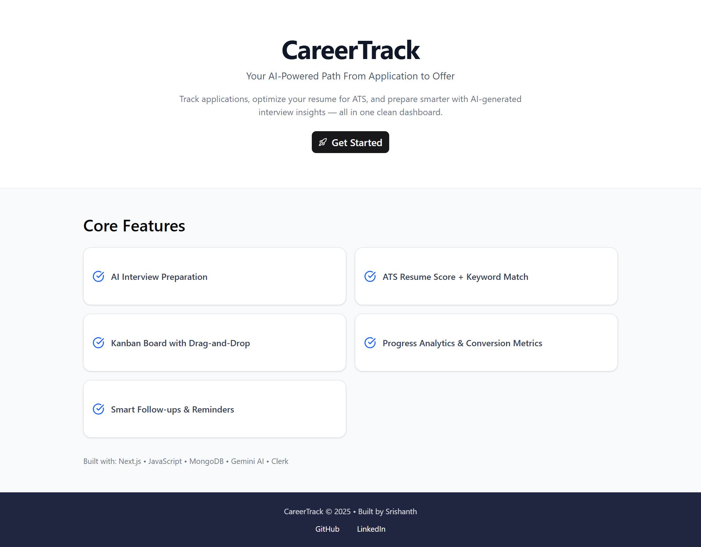
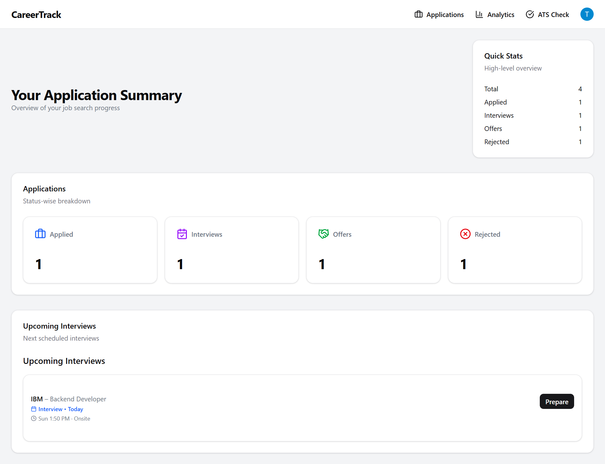
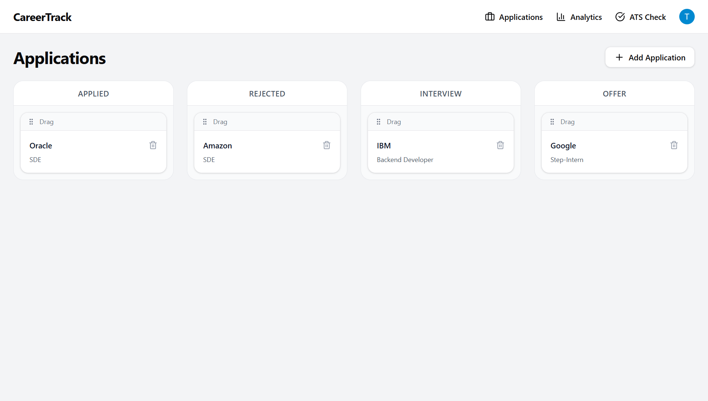
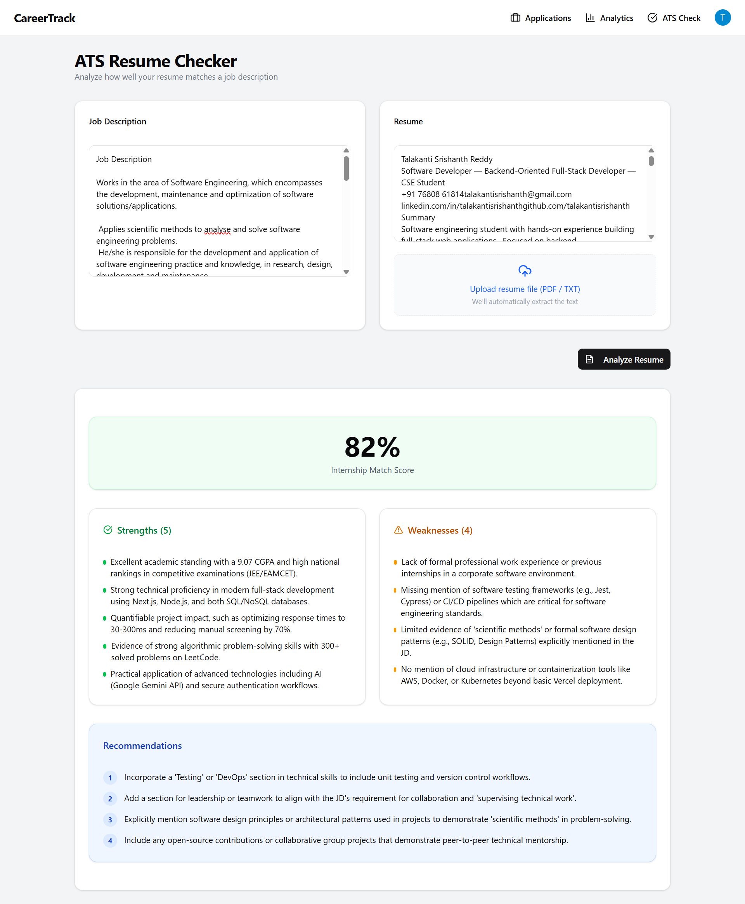
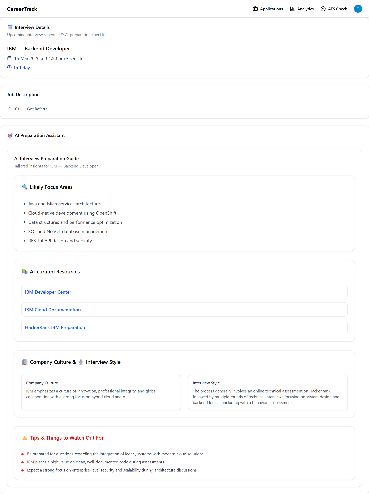

# **CareerTrack – AI-Powered Job Search Tracker**

A full‑stack job tracking platform with a Kanban board, **AI‑powered ATS resume check**, **AI interview preparation**, automatic **email reminders for upcoming interviews**, and analytics — all in a clean, responsive UI.

---

## **Live Demo**

Frontend: https://careertrack-murex.vercel.app/

(Backend APIs are part of the same Next.js app.)

---

## **Preview**

## Screenshots

### Landing Page


### Dashboard


### Kanban Job Tracker


### ATS Resume Analysis


### AI Interview Preparation


---

## **Features**

- **Kanban job tracker**
  - Drag‑and‑drop board for statuses: Applied, Interview, Offer, Rejected.
  - Quick stats for total applications and each status.
  - Separate views for each status and detailed application cards.

- **AI‑powered ATS resume check**
  - Paste or upload your resume (PDF / TXT).
  - Optionally add the job description.
  - Uses **Google Gemini AI** to:
    - Analyze keyword match vs JD.
    - Score resume quality.
    - Suggest improvements and missing skills.

- **AI‑powered interview prep**
  - For each interview, generate:
    - Focus areas.
    - Resources (Title | URL).
    - Company culture notes.
    - Likely interview style + warnings.
  - Powered by **Gemini AI** with a typed response schema.

- **Automatic interview reminders**
  - Serverless cron endpoint checks interviews scheduled in the next **7 days**.
  - Sends email reminders via **Resend** using a React email template.
  - Looks up user emails via **Clerk**.

- **Analytics & insights**
  - High‑level stats and analytics views for your pipeline.
  - Track how many applications lead to interviews, offers, rejections, etc.

- **Authentication**
  - Secure login and session management using **Clerk**.
  - All data is scoped per user via `userId`.

- **Responsive design**
  - Fully responsive layout with modern UI using **Tailwind CSS** and shadcn‑style components.

---

## **Tech Stack**

- **Frontend / Backend (monolith)**: Next.js (App Router), React
- **Styling**: Tailwind CSS v4, custom UI components, shadcn‑style primitives
- **Drag & Drop**: `@dnd-kit/core`, `@dnd-kit/sortable`
- **Database**: MongoDB with `mongoose`
- **Auth**: Clerk (`@clerk/nextjs`)
- **AI**: Google Gemini (`@google/genai`)
- **Email**: Resend + `@react-email/components`
- **Charts / Analytics**: `recharts`
- **Icons**: `lucide-react`

---

## **Project Structure**
```text
careertrack/
│
├── src/
│   ├── app/                          # Next.js App Router
│   │   ├── layout.js                 # Root layout
│   │   ├── page.js                   # Dashboard (home)
│   │   ├── globals.css               # Global styles
│   │   ├── loading.js                # Global loading UI
│   │   ├── error.js                  # Global error boundary
│   │   │
│   │   ├── components/               # App-specific reusable components
│   │   │   ├── Navbar.jsx
│   │   │   ├── HeroSection.jsx
│   │   │   ├── Column.jsx
│   │   │   ├── ApplicationCard.jsx
│   │   │   ├── ApplicationsHome.jsx
│   │   │   ├── ApplicationsClient.jsx
│   │   │   ├── UpcomingInterviews.jsx
│   │   │   └── emailTemplate/
│   │   │       └── InterviewReminder.jsx
│   │   │
│   │   ├── applications/             # Job application pages
│   │   ├── atscheck/                 # ATS resume checker
│   │   ├── interviewPrep/            # AI interview preparation
│   │   ├── analytics/                # Analytics dashboard
│   │   │
│   │   └── api/                      # Serverless API routes
│   │       ├── applications/
│   │       ├── ats/
│   │       ├── interviewprep/
│   │       └── cron/
│   │           └── interview-reminders/
│   │
│   ├── components/ui/                # Generic UI primitives
│   │
│   ├── lib/
│   │   ├── mongodb.js
│   │   └── utils.js
│   │
│   ├── models/
│   │   ├── Application.js
│   │   └── AtsSchema.js
│   │
│   └── proxy.js
│
├── public/
├── package.json
└── README.md

```
## **Setup & Installation**

### 1. Clone the repository

```bash
git clone https://github.com/TalakantiSrishanth/Careertrack.git
cd Careertrack
```

---

### 2. Install dependencies

```bash
npm install
```

---

### 3. Create `.env.local`

```env
# MongoDB
MONGODB_URI=your_mongodb_connection_string

# Clerk (Authentication)
NEXT_PUBLIC_CLERK_PUBLISHABLE_KEY=your_clerk_publishable_key
CLERK_SECRET_KEY=your_clerk_secret_key

# Gemini AI
GEMINI_API_KEY=your_google_gemini_api_key

# Resend (Email Service)
RESEND_API_KEY=your_resend_api_key

# Base URL
NEXT_PUBLIC_BASE_URL=http://localhost:3000

# For production
# NEXT_PUBLIC_BASE_URL=https://careertrack-murex.vercel.app
```

---

### 4. Configure Services

**Clerk Dashboard**

* Add allowed URLs
* Configure redirect URIs

**Resend Dashboard**

* Verify sender email or domain
* Update the `from` email address used in reminder emails

---

### 5. Run the application

```bash
npm run dev
```

The application will run at:

```
http://localhost:3000
```

After signing in with **Clerk authentication**, users are redirected to the **main dashboard** where they can start tracking job applications.

---

## Data Model

```json
{
  "_id": "ObjectId",
  "userId": "string",
  "company": "string",
  "title": "string",
  "status": "applied | interview | offer | rejected",
  "description": "string",
  "interview": {
    "date": "Date",
    "mode": "online | onsite | phone",
    "notes": "string"
  },
  "createdAt": "Date",
  "updatedAt": "Date"
}
```

---

# **API Overview**

## Applications

### GET `/api/applications`

Returns all applications for the authenticated user.

### POST `/api/applications`

Creates a new job application.

### GET `/api/applications/:id`

Returns a specific application.

### PUT `/api/applications/:id`

Updates an existing application.

### DELETE `/api/applications/:id`

Deletes an application.

---

## ATS Resume Check

### POST `/api/ats`

Uses **Gemini AI + ATSSchema** to analyze resume compatibility with ATS systems.

#### Request Body

```json
{
  "resumeText": "Full resume text here...",
  "jobDescription": "Optional job description...",
  "type": "internship"
}
```

---

## Interview Preparation

### POST `/api/interviewprep`

Generates AI-powered interview preparation guidance.

#### Request Body

```json
{
  "companyName": "Google",
  "jobTitle": "Software Engineer Intern"
}
```

---

## Interview Reminders (Cron Job)

### GET `/api/cron/interview-reminders`

This endpoint:

* Finds interviews scheduled within the **next 7 days**
* Uses **Clerk** to fetch user emails
* Sends reminder emails via **Resend**

Recommended setup:

Use **Vercel Cron** or any scheduler to trigger this endpoint **once per day**.


## Author

**Talakanti Srishanth Reddy**

GitHub: https://github.com/TalakantiSrishanth
